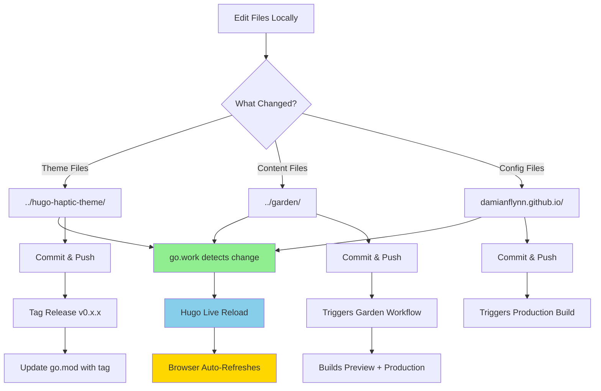
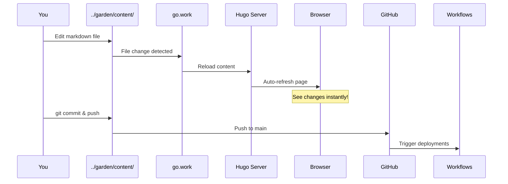
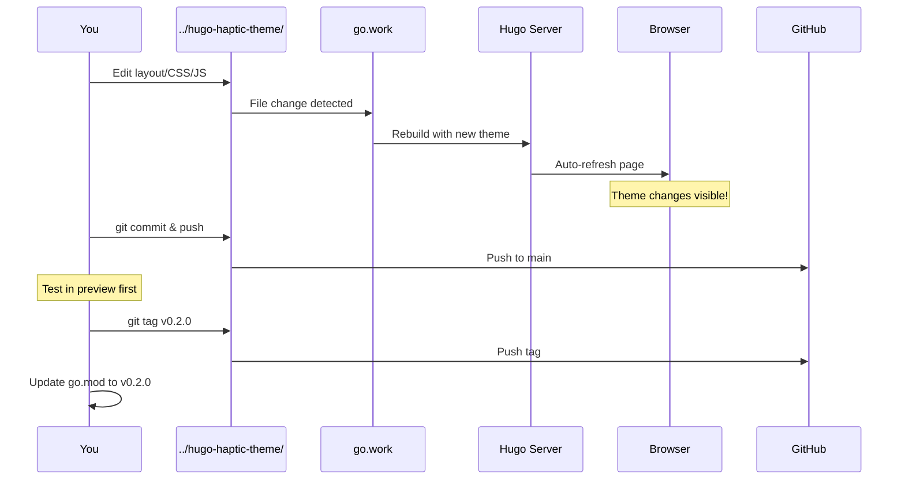
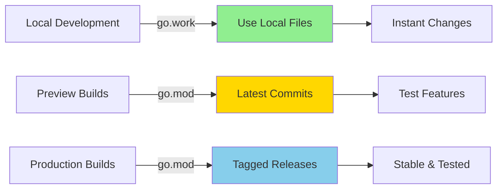

# Local Development Guide

This guide helps you set up and work with the Hugo site locally using the modular architecture.

## Prerequisites

- **Hugo Extended** v0.154.2+ ([install](https://gohugo.io/installation/))
- **Go** 1.22+ ([install](https://go.dev/doc/install))
- **Git** ([install](https://git-scm.com/downloads))

## Development Workflow Overview



## Repository Structure

Your blog is split into 3 repositories:

```
~/Development/damianflynn/
├── damianflynn.github.io/   # Main Hugo site (this repo)
├── hugo-haptic-theme/        # Custom theme
└── garden/                   # Content from Notion
```

## Initial Setup

### 1. Clone All Repositories

```bash
cd ~/Development/damianflynn

# Clone main site
git clone https://github.com/DamianFlynn/damianflynn.github.io.git

# Clone theme
git clone https://github.com/DamianFlynn/hugo-haptic-theme.git

# Clone content
git clone https://github.com/DamianFlynn/garden.git
```

### 2. Set Up Local Development

Create a `go.work` file for local development. This file tells Go to use your local copies of the theme and content modules instead of fetching from GitHub.

**Important:** The `go.work` file is listed in `.gitignore` and should never be committed to the repository (it would break CI/CD).

```bash
cd damianflynn.github.io

# Create go.work file
cat > go.work << 'EOF'
go 1.22

use .
use ../hugo-haptic-theme
use ../garden
EOF

# Initialize Hugo modules
hugo mod tidy

# Verify the setup
hugo mod graph
```

You should see output showing the local module paths.

## Daily Development Workflow

### Starting the Development Server

```bash
cd ~/Development/damianflynn/damianflynn.github.io

# Start Hugo server with drafts and live reload
hugo server -D

# Or with more options for better development experience
hugo server -D --disableFastRender --navigateToChanged
```

The site will be available at: http://localhost:1313

**✨ Live Reload Magic:**
- Changes to **theme files** (layouts, CSS, JS) → instant browser refresh
- Changes to **content files** (markdown) → instant browser refresh  
- Changes to **config files** (TOML) → instant browser refresh
- Works across all three repositories thanks to `go.work`!

### Working on Content (Garden)



**Steps:**
1. Edit content in `../garden/content/posts/your-post/index.md`
2. **Save** → Browser auto-refreshes in ~500ms
3. Commit and push when ready:

```bash
cd ../garden
git add .
git commit -m "Add new post: Your Post Title"
git push origin main  # Triggers preview + production builds
```

### Working on the Theme (Haptic)



**Steps:**
1. Edit theme files in `../hugo-haptic-theme/layouts/` or `assets/`
2. **Save** → Browser auto-refreshes immediately
3. Commit when ready:

```bash
cd ../hugo-haptic-theme
git add .
git commit -m "Update: description of changes"
git push origin main
```

4. **Release stable version** (for production):

```bash
# Tag a release
git tag v0.2.0
git push origin v0.2.0

# Update main site to use the tag
cd ../damianflynn.github.io
hugo mod get -u github.com/DamianFlynn/hugo-haptic-theme@v0.2.0
hugo mod tidy
git commit -am "Update theme to v0.2.0"
git push origin main
```

### Working on Site Configuration

1. Edit config files in `config/_default/`
2. **Save** → Hugo restarts and browser refreshes
3. Commit and push:

```bash
cd ~/Development/damianflynn/damianflynn.github.io
git add .
git commit -m "Config: description of changes"
git push origin main  # Triggers production build
```

## Module Version Strategy



### Local (Best Experience)
- Uses `go.work` to reference local directories
- Changes appear **instantly** in browser
- No commits needed to test
- Never touches `go.mod`

### Preview (Testing)
- Uses latest commits from `main` branch
- Good for testing unreleased features
- Update with: `hugo mod get -u @main`

### Production (Stable)
- Uses **tagged releases** (v0.1.0, v0.1.1, etc.)
- Only updates with explicit version bump
- Update with: `hugo mod get -u @v0.2.0`

## Common Tasks

### Testing Live Reload

**Test 1: Theme Change**
1. Start Hugo: `hugo server -D`
2. Open http://localhost:1313 in Chrome/VS Code browser
3. Edit `../hugo-haptic-theme/layouts/partials/header.html`
4. **Save** → Watch browser refresh automatically (~500ms)

**Test 2: Content Change**
1. With Hugo server running
2. Edit any file in `../garden/content/posts/`
3. **Save** → Browser refreshes instantly

**Test 3: CSS Change**
1. With Hugo server running
2. Edit `../hugo-haptic-theme/assets/css/main.css`
3. **Save** → Browser hot-reloads CSS (no page refresh!)

### VS Code Live Preview

Install the "Live Preview" extension and use `hugo server -D`, or:

```bash
# Hugo server binds to localhost by default
hugo server -D --bind 0.0.0.0

# Then access from VS Code browser or any device on network
# http://localhost:1313
```

### Update Module Versions

When you want to pull latest changes from remote modules:

```bash
# Update all modules to latest
hugo mod get -u

# Or update specific module
hugo mod get -u github.com/DamianFlynn/hugo-haptic-theme
hugo mod get -u github.com/DamianFlynn/garden

# Update to specific version/tag
hugo mod get -u github.com/DamianFlynn/hugo-haptic-theme@v0.2.0

# Clean module cache if needed
hugo mod clean
hugo mod tidy
```

### Build for Testing

```bash
# Build without drafts (production-like)
hugo --gc --minify

# Build with drafts (preview-like)
hugo --gc --minify -D
```

### Troubleshooting

**Module not found errors:**
```bash
# Clear Hugo cache
hugo mod clean

# Verify go.work is being used
go env GOWORK
# Should output: /Users/damian/Development/damianflynn/damianflynn.github.io/go.work
```

**Changes not reflecting:**
```bash
# Restart server without fast render
hugo server -D --disableFastRender --noHTTPCache
```

**Port already in use:**
```bash
# Use a different port
hugo server -D -p 1314
```

## Deployment

Deployment is automatic via GitHub Actions:

- **Production**: Pushes to `main` branch deploy to GitHub Pages
- **Preview**: Pull requests deploy to Cloudflare Pages

You don't need to manually deploy. Just push your changes!

## Tips for Productivity

1. **Keep Hugo running**: Let `hugo server` run while you work
2. **Work in branches**: Create feature branches for major changes
3. **Test locally first**: Always verify changes locally before pushing
4. **Use draft mode**: Add `draft: true` to frontmatter for work-in-progress posts
5. **Check module versions**: Run `hugo mod graph` periodically to see dependencies

## VS Code Setup (Optional)

Create [.vscode/settings.json](file:///Users/damian/Development/damianflynn/damianflynn.github.io/.vscode/settings.json) for better DX:

```json
{
  "files.associations": {
    "*.toml": "toml",
    "*.md": "markdown"
  },
  "markdown.preview.breaks": true,
  "markdown.preview.linkify": true,
  "[markdown]": {
    "editor.wordWrap": "on",
    "editor.quickSuggestions": true
  }
}
```

## Need Help?

- Hugo Docs: https://gohugo.io/documentation/
- Go Modules: https://go.dev/doc/modules/managing-dependencies
- Theme Repo: https://github.com/DamianFlynn/hugo-haptic-theme
- Content Repo: https://github.com/DamianFlynn/garden
