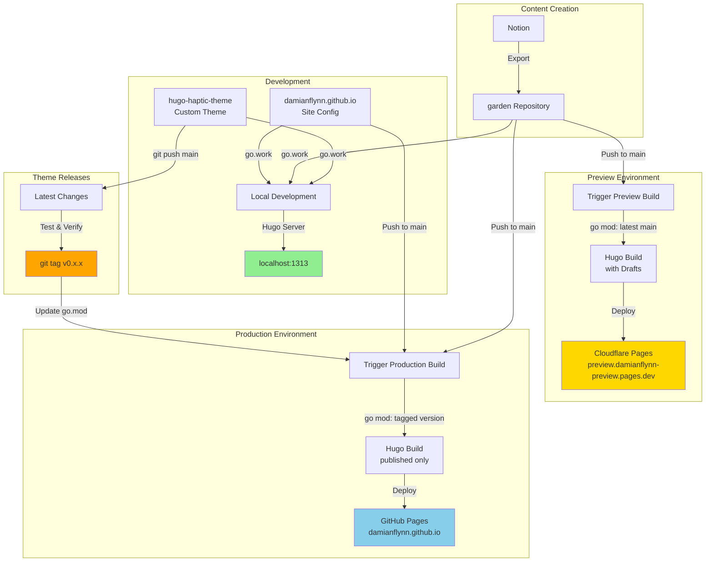
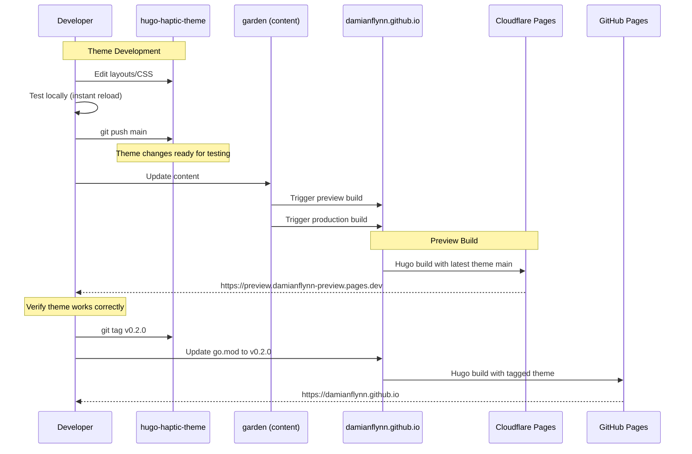

# damianflynn.com

My personal blog powered by Hugo, featuring a modular architecture with separate repositories for theme, content, and configuration.

🌐 **Live Site**: https://damianflynn.github.io  
🔬 **Preview Site**: https://preview.damianflynn-preview.pages.dev

## Architecture



## Repository Structure

This blog is built from three separate repositories:

| Repository | Purpose | Technology |
|-----------|---------|------------|
| **[damianflynn.github.io](https://github.com/DamianFlynn/damianflynn.github.io)** | Main site configuration | Hugo config, workflows |
| **[hugo-haptic-theme](https://github.com/DamianFlynn/hugo-haptic-theme)** | Custom theme | Hugo layouts, CSS, JS |
| **[garden](https://github.com/DamianFlynn/garden)** | Content from Notion | Markdown posts, images |

## Quick Start

### Local Development

```bash
# Clone all repositories side-by-side
cd ~/Development/damianflynn
git clone https://github.com/DamianFlynn/damianflynn.github.io.git
git clone https://github.com/DamianFlynn/hugo-haptic-theme.git
git clone https://github.com/DamianFlynn/garden.git

# Start development server
cd damianflynn.github.io
./dev-server.sh
```

Visit http://localhost:1313 - changes to theme/content auto-reload instantly!

**See [SETUP.md](SETUP.md) for complete setup instructions.**

## Deployment Strategy

### Environment Versioning

| Environment | Theme Version | Content Version | Purpose |
|-------------|---------------|-----------------|---------|
| **Local** | Local files (`go.work`) | Local files | Instant development feedback |
| **Preview** | Latest `main` branch | Latest `main` | Test unreleased features |
| **Production** | Tagged releases (e.g., `v0.1.1`) | Latest `main` | Stable public site |

### How Deployments Work



### Deployment Triggers

**Preview** (Cloudflare Pages):
- Garden content updates (automatic)
- Manual trigger via GitHub Actions

**Production** (GitHub Pages):
- Garden content updates (automatic)
- Main site config/workflow changes
- Theme version updates in go.mod

## Common Tasks

### Writing New Content

1. Create/edit in Notion → Export to garden repository
2. Or edit directly: `cd ~/Development/damianflynn/garden/content/posts/`
3. Test locally (auto-reloads)
4. Commit and push → Both environments deploy automatically

```bash
cd ~/Development/damianflynn/garden
git add .
git commit -m "Add article: My New Post"
git push origin main
# Preview and production deploy automatically
```

### Developing Theme Features

1. Edit theme files: `~/Development/damianflynn/hugo-haptic-theme/`
2. Test locally (auto-reloads)
3. Push to test in preview
4. Tag when stable for production

```bash
cd ~/Development/damianflynn/hugo-haptic-theme
# Edit layouts, CSS, JS...
git add .
git commit -m "Feature: Add dark mode toggle"
git push origin main
# Preview uses this automatically

# After testing, release to production:
git tag -a v0.2.0 -m "Release v0.2.0: Dark mode support"
git push origin v0.2.0

cd ~/Development/damianflynn/damianflynn.github.io
HUGO_MODULE_WORKSPACE=go.work hugo mod get github.com/DamianFlynn/hugo-haptic-theme@v0.2.0
git add go.mod go.sum
git commit -m "Update theme to v0.2.0"
git push origin main
```

### Updating Site Configuration

```bash
cd ~/Development/damianflynn/damianflynn.github.io
# Edit config/_default/*.toml files
git add config/
git commit -m "Update site navigation"
git push origin main
# Production deploys automatically
```

## Project Files

```
damianflynn.github.io/
├── config/              # Hugo configuration
│   └── _default/
│       ├── config.toml  # Site settings
│       ├── params.toml  # Theme parameters
│       ├── menu.toml    # Navigation
│       └── ...
├── .github/
│   └── workflows/
│       ├── deploy-production.yaml   # GitHub Pages deployment
│       └── deploy-preview.yaml      # Cloudflare Pages deployment
├── go.mod              # Module dependencies (production versions)
├── go.work            # Local development workspace (gitignored)
├── dev-server.sh      # Local development helper script
└── public/            # Generated site (gitignored)
```

## Technology Stack

- **[Hugo](https://gohugo.io/)** v0.154.2+ Extended - Static site generator
- **[Go](https://go.dev/)** 1.22+ - Module system
- **[GitHub Actions](https://github.com/features/actions)** - CI/CD
- **[GitHub Pages](https://pages.github.com/)** - Production hosting
- **[Cloudflare Pages](https://pages.cloudflare.com/)** - Preview hosting
- **[Notion](https://notion.so/)** - Content authoring

## Documentation

- **[SETUP.md](SETUP.md)** - Complete setup guide for local development and cloud deployments
- **[docs/TROUBLESHOOTING.md](docs/TROUBLESHOOTING.md)** - Common issues and solutions

## Versioning Strategy

The theme uses [Semantic Versioning](https://semver.org/):

- **v0.1.x** - Bug fixes and patches
- **v0.x.0** - New features (backward compatible)
- **vx.0.0** - Breaking changes

Content in the `garden` repository is always deployed from the latest `main` branch.

## Contributing

This is a personal blog, but if you find issues or have suggestions:

1. Open an issue in the relevant repository
2. For theme issues: [hugo-haptic-theme/issues](https://github.com/DamianFlynn/hugo-haptic-theme/issues)
3. For site issues: [damianflynn.github.io/issues](https://github.com/DamianFlynn/damianflynn.github.io/issues)

## License

- Site content: © Damian Flynn
- Theme code: GPL-3.0 License (see [hugo-haptic-theme/LICENSE](https://github.com/DamianFlynn/hugo-haptic-theme/blob/main/LICENSE))

---

Built with ❤️ using Hugo and Go modules

