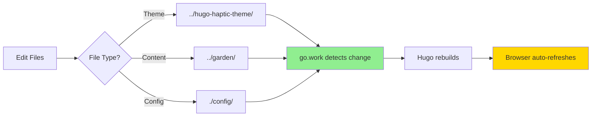
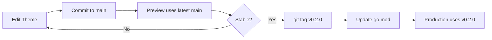

# Complete Setup Guide

This guide covers everything you need to set up local development and configure cloud deployments for damianflynn.com.

## Table of Contents

1. [Prerequisites](#prerequisites)
2. [Local Development Setup](#local-development-setup)
3. [GitHub Pages Setup (Production)](#github-pages-setup-production)
4. [Cloudflare Pages Setup (Preview)](#cloudflare-pages-setup-preview)
5. [Development Workflows](#development-workflows)
6. [Troubleshooting](#troubleshooting)

## Prerequisites

Install these tools before starting:

### Required Software

| Tool | Version | Purpose | Install Link |
|------|---------|---------|--------------|
| **Hugo Extended** | v0.154.2+ | Static site generator | [gohugo.io/installation](https://gohugo.io/installation/) |
| **Go** | 1.22+ | Module system | [go.dev/doc/install](https://go.dev/doc/install) |
| **Git** | 2.0+ | Version control | [git-scm.com/downloads](https://git-scm.com/downloads) |

### Verify Installation

```bash
hugo version  # Should show v0.154.2+ extended
go version    # Should show go1.22 or later
git --version # Should show git 2.0 or later
```

## Local Development Setup

### Step 1: Clone All Repositories

Clone all three repositories **side-by-side** in the same parent directory:

```bash
# Create parent directory
mkdir -p ~/Development/damianflynn
cd ~/Development/damianflynn

# Clone all repositories
git clone https://github.com/DamianFlynn/damianflynn.github.io.git
git clone https://github.com/DamianFlynn/hugo-haptic-theme.git
git clone https://github.com/DamianFlynn/garden.git
```

Your directory structure should look like:

```
~/Development/damianflynn/
├── damianflynn.github.io/   # Main site
├── hugo-haptic-theme/        # Theme
└── garden/                   # Content
```

### Step 2: Create Go Workspace

The `go.work` file tells Hugo to use your local repositories instead of downloading from GitHub:

```bash
cd damianflynn.github.io

# Create go.work file (already exists, but here's what it contains)
cat go.work
```

Should contain:

```go
go 1.22

use .
use ../hugo-haptic-theme
use ../garden
```

**Important**: `go.work` is in `.gitignore` and should NEVER be committed (it would break CI/CD).

### Step 3: Start Development Server

```bash
cd ~/Development/damianflynn/damianflynn.github.io

# Start Hugo server
./dev-server.sh

# Or manually:
HUGO_MODULE_WORKSPACE=go.work hugo server -D
```

Visit **http://localhost:1313** in your browser.

### Step 4: Verify Live Reload

Test that changes appear instantly:

**Test Theme Changes:**
```bash
# In a new terminal
cd ~/Development/damianflynn/hugo-haptic-theme
# Edit any file in layouts/ or assets/
# Save → Browser auto-refreshes
```

**Test Content Changes:**
```bash
cd ~/Development/damianflynn/garden
# Edit any .md file in content/posts/
# Save → Browser auto-refreshes
```

**Test Config Changes:**
```bash
cd ~/Development/damianflynn/damianflynn.github.io
# Edit config/_default/params.toml
# Save → Hugo restarts → Browser refreshes
```

### Development Workflow



## GitHub Pages Setup (Production)

GitHub Pages is already configured if you forked/cloned this repository. Here's how it works:

### Automatic Setup

1. **Workflow File**: [.github/workflows/deploy-production.yaml](.github/workflows/deploy-production.yaml)
2. **Trigger**: Pushes to `main` branch or garden content updates
3. **Deployment**: https://damianflynn.github.io

### Manual Setup (if starting fresh)

#### 1. Enable GitHub Pages

1. Go to repository **Settings** → **Pages**
2. **Source**: Deploy from a branch
3. **Branch**: `gh-pages` / `(root)`
4. Click **Save**

#### 2. Verify Workflow Permissions

1. Go to **Settings** → **Actions** → **General**
2. **Workflow permissions**: Select "Read and write permissions"
3. Enable "Allow GitHub Actions to create and approve pull requests"
4. Click **Save**

#### 3. Test Deployment

```bash
cd ~/Development/damianflynn/damianflynn.github.io
git commit --allow-empty -m "Trigger deployment test"
git push origin main
```

Watch the deployment:
- Go to **Actions** tab
- Click on "Deploy Production" workflow
- Wait ~2 minutes
- Visit https://YOUR_USERNAME.github.io

### Environment Configuration

The production workflow uses the `github-pages` environment (auto-created by GitHub Pages):

```yaml
environment:
  name: github-pages
  url: https://damianflynn.github.io
```

## Cloudflare Pages Setup (Preview)

Set up Cloudflare Pages for preview deployments with drafts and unreleased content.

### Step 1: Create Cloudflare API Token

1. Go to [Cloudflare Dashboard](https://dash.cloudflare.com/)
2. Click your profile → **API Tokens**
3. Click **Create Token**
4. Click **Create Custom Token**

**Token Configuration:**
- **Token name**: `GitHub Actions - Cloudflare Pages`
- **Permissions**:
  - Account → Cloudflare Pages → Edit
- **Account Resources**:
  - Include → Your Account
- **Client IP Address Filtering**: (leave empty)
- **TTL**: (leave as default or set expiration)

5. Click **Continue to summary**
6. Click **Create Token**
7. **Copy the token** (you won't see it again!)

### Step 2: Find Your Account ID

1. In Cloudflare Dashboard, click on any domain
2. Scroll down in the right sidebar
3. Copy your **Account ID**

Or use this URL format:
```
https://dash.cloudflare.com/<ACCOUNT_ID>/
```

### Step 3: Add Secrets to GitHub

1. Go to repository **Settings** → **Secrets and variables** → **Actions**
2. Click **New repository secret**

**Add these two secrets:**

| Name | Value |
|------|-------|
| `CLOUDFLARE_API_TOKEN` | The token you created in Step 1 |
| `CLOUDFLARE_ACCOUNT_ID` | Your account ID from Step 2 |

### Step 4: Create Cloudflare Pages Project

The first workflow run will create the project automatically, or create it manually:

```bash
# Install Wrangler CLI (if not already installed)
npm install -g wrangler

# Login to Cloudflare
wrangler login

# Create project
wrangler pages project create damianflynn-preview --production-branch=main
```

### Step 5: Test Preview Deployment

```bash
cd ~/Development/damianflynn/damianflynn.github.io

# Trigger preview workflow manually
# Go to GitHub → Actions → Deploy Preview → Run workflow
```

Or trigger via content update:

```bash
cd ~/Development/damianflynn/garden
git commit --allow-empty -m "Trigger preview deployment"
git push origin main
```

Preview URL: https://preview.damianflynn-preview.pages.dev

### Cloudflare Pages Settings (Optional)

In Cloudflare Dashboard → Pages → damianflynn-preview:

**Build Settings**:
- Framework preset: None
- Build command: (leave empty - GitHub Actions handles builds)
- Build output directory: (leave empty)

**Custom Domains** (optional):
- Add: preview.damianflynn.com
- Configure DNS as instructed

## Development Workflows

### Scenario 1: Writing New Content

```bash
# 1. Edit in Notion and export, or edit directly:
cd ~/Development/damianflynn/garden/content/posts/my-new-post
vim index.md

# 2. Test locally (Hugo server auto-reloads)
# Visit http://localhost:1313

# 3. Commit and push
git add .
git commit -m "Add post: My New Post Title"
git push origin main

# 4. Automatic deployments triggered:
#    - Preview: Latest theme main + new content
#    - Production: Tagged theme + new content
```

**Result:**
- Preview: https://preview.damianflynn-preview.pages.dev (~2 min)
- Production: https://damianflynn.github.io (~2 min)

### Scenario 2: Developing Theme Features

```bash
# 1. Edit theme locally
cd ~/Development/damianflynn/hugo-haptic-theme/layouts
# Edit files... Hugo auto-reloads

# 2. Test thoroughly in browser

# 3. Commit theme changes
git add .
git commit -m "Feature: Add search functionality"
git push origin main

# 4. Test in preview (wait for next content update or trigger manually)

# 5. When stable, tag for production
git tag -a v0.2.0 -m "Release v0.2.0: Add search"
git push origin v0.2.0

# 6. Update production to use new version
cd ~/Development/damianflynn/damianflynn.github.io
HUGO_MODULE_WORKSPACE=go.work hugo mod get github.com/DamianFlynn/hugo-haptic-theme@v0.2.0
git add go.mod go.sum
git commit -m "Update theme to v0.2.0"
git push origin main
```

**Version Flow:**


### Scenario 3: Site Configuration

```bash
# 1. Edit config files
cd ~/Development/damianflynn/damianflynn.github.io/config/_default
vim params.toml  # Hugo server auto-reloads

# 2. Test locally

# 3. Commit and push
git add config/
git commit -m "Update navigation menu"
git push origin main

# Production deploys automatically
```

### Scenario 4: Emergency Hotfix

```bash
# 1. Fix critical bug in theme
cd ~/Development/damianflynn/hugo-haptic-theme
# Fix the bug...
git add .
git commit -m "Fix: Critical rendering issue"
git push origin main

# 2. Immediately tag and deploy
git tag -a v0.1.2 -m "Hotfix v0.1.2: Fix rendering"
git push origin v0.1.2

# 3. Update production
cd ~/Development/damianflynn/damianflynn.github.io
HUGO_MODULE_WORKSPACE=go.work hugo mod get github.com/DamianFlynn/hugo-haptic-theme@v0.1.2
git add go.mod go.sum
git commit -m "Hotfix: Update theme to v0.1.2"
git push origin main
```

## Troubleshooting

### Local Development Issues

#### Hugo Server Not Finding Modules

**Symptom**: `module "github.com/DamianFlynn/hugo-haptic-theme" not found`

**Solution**:
```bash
# Verify HUGO_MODULE_WORKSPACE is set
env | grep HUGO_MODULE_WORKSPACE
# Should show: HUGO_MODULE_WORKSPACE=go.work

# Or use the helper script
./dev-server.sh
```

#### Changes Not Reflecting

**Symptom**: Saved changes don't appear in browser

**Solution**:
```bash
# Clear all caches
./dev-server.sh clean

# Or manually:
hugo mod clean
rm -rf ~/Library/Caches/hugo_cache  # macOS
rm -rf ~/.cache/hugo_cache          # Linux
rm -rf public/ resources/
```

#### Port Already in Use

**Symptom**: `bind: address already in use`

**Solution**:
```bash
# Kill existing Hugo process
pkill hugo

# Or use different port
HUGO_MODULE_WORKSPACE=go.work hugo server -D -p 1314
```

### Deployment Issues

#### GitHub Pages Not Deploying

**Check**:
1. Go to **Actions** tab - look for failed workflows
2. Verify **Settings** → **Pages** → Source is set to `gh-pages`
3. Check workflow permissions in **Settings** → **Actions** → **General**

**Solution**:
```bash
# Trigger manual deployment
git commit --allow-empty -m "Trigger deployment"
git push origin main
```

#### Cloudflare Pages Authentication Error

**Symptom**: `Unable to authenticate request`

**Solution**:
1. Verify `CLOUDFLARE_API_TOKEN` in GitHub Secrets
2. Check token hasn't expired in Cloudflare Dashboard
3. Verify token has "Cloudflare Pages → Edit" permission (not Workers)

#### Wrong Theme Version Deployed

**Preview showing old theme**:
```bash
# Preview always uses latest main
# Check theme repository's main branch
cd ~/Development/damianflynn/hugo-haptic-theme
git log -1 --oneline
```

**Production showing wrong version**:
```bash
# Check go.mod
cd ~/Development/damianflynn/damianflynn.github.io
cat go.mod | grep hugo-haptic-theme

# Update if needed
HUGO_MODULE_WORKSPACE=go.work hugo mod get github.com/DamianFlynn/hugo-haptic-theme@v0.2.0
git add go.mod go.sum
git commit -m "Update theme version"
git push origin main
```

### Module Cache Issues

**Symptom**: Build using old modules despite updates

**Solution**:
```bash
# Clear Hugo module cache
hugo mod clean

# Clear Go module cache
go clean -modcache

# On CI/CD, this happens automatically in workflows
```

## Advanced Configuration

### Custom Domain for GitHub Pages

1. Buy domain (e.g., damianflynn.com)
2. Add DNS records:
   ```
   Type: A
   Name: @
   Value: 185.199.108.153
   
   Type: CNAME
   Name: www
   Value: damianflynn.github.io
   ```
3. In repository: **Settings** → **Pages** → **Custom domain**
4. Enter: `damianflynn.com`
5. Enable "Enforce HTTPS"

### Custom Domain for Cloudflare Pages

1. In Cloudflare Pages project settings
2. **Custom domains** → **Set up a custom domain**
3. Enter: `preview.damianflynn.com`
4. DNS configured automatically (if using Cloudflare DNS)

## Tips for Success

1. ✅ **Always test locally first** before pushing
2. ✅ **Use preview for testing** unreleased theme features
3. ✅ **Tag theme versions** for production stability
4. ✅ **Keep Hugo server running** while developing
5. ✅ **Clear caches** when things seem wrong
6. ✅ **Check Actions tab** for deployment status
7. ✅ **Use descriptive commit messages** for clarity

## Need Help?

- Hugo Documentation: https://gohugo.io/documentation/
- Go Modules Guide: https://go.dev/doc/modules/managing-dependencies
- GitHub Actions Docs: https://docs.github.com/actions
- Cloudflare Pages Docs: https://developers.cloudflare.com/pages/

---

**Next Steps**: Return to [README.md](README.md) for common workflows
