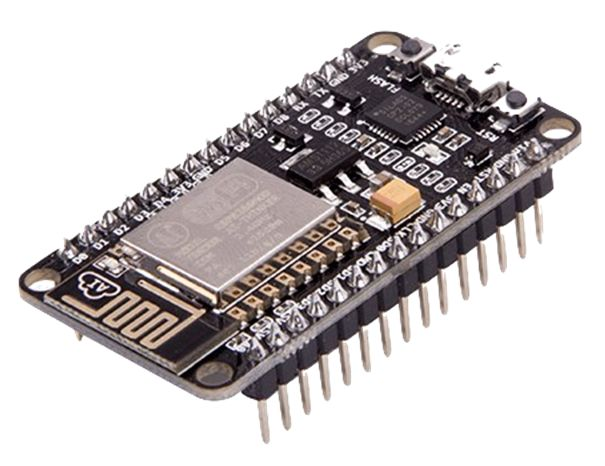
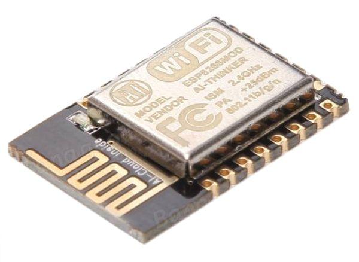
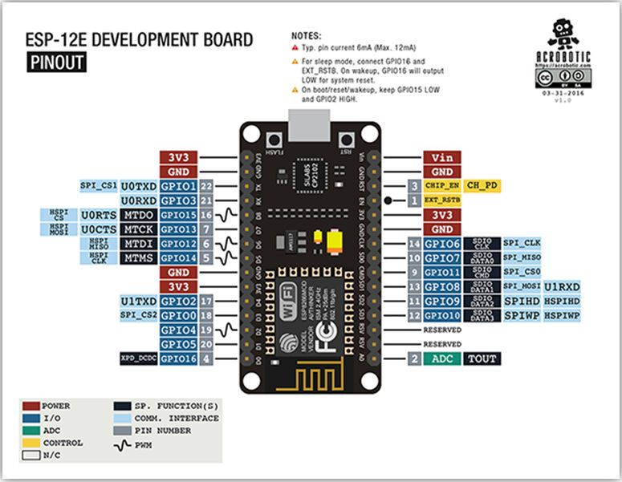
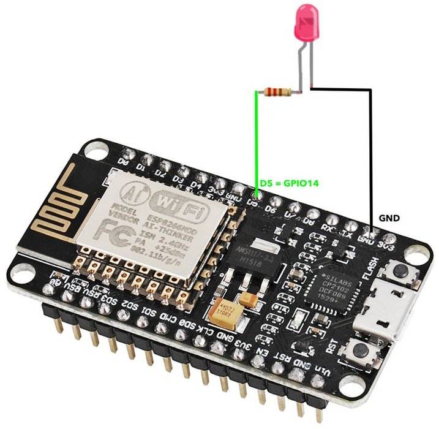

# NodeMCU Pinouts


For the past year, I have been using a tiny board, known as the **NodeMCU** which is essentially a developer board for a module know as the **ESP8266**. The **NodeMCU** is formed by an **ESP12E**, which still has an **ESP8266EX** inside it.



This device is really nice to work with, it is supplied preconfigured with a Micro USB input, for both programming and power.

>  The term NodeMCU usually refers to the firmware, while the board is called Devkit. NodeMCU Devkit 1.0 consists of an ESP-12E on a board, along with a voltage regulator, a USB interface. 
# ESP-12E

The board created by AI-THINKER, which consists of an *Espressif ESP8266EX* inside the metal cover. The microchip has a low-power consumption profile, integrated WiFi and the *RISC Tensilica L106 32bit Processor* has a maximum clock of 160 MHz

The following illustrates the pinouts on this board



ESP-12E_Pinout


# IDE

I have so far being developing on this board using VS Code, and its integrations with the Arduino IDE. While this works well, I am currently considering alternative approach’s; as the debugging experience is far from optimal in my opinion; but that is work for another day.

The power of this board however, is understanding how to connect with outside world, and in this case what are the correct pin identifiers, trough reference of the NodeMCU datasheet and how the board boot’s.

# NodeMCU Pinout

The Devkit board which we are leveraging maps the pinouts from the ESP-12E module as follows:



Translating this however to the code we are going to develop in the Arduino sketch’s; we need to reference the pins with thier respective names; which is illustrated in this following image


Use the number that is in front of the GPIO or the constants as follows

  ## Pin IO Functions

When performing INPUT and OUTPUT tests on the pins, we obtained the following results:

  ## Flashing Sketch

The following simple sketch should flash an LED connected directly to the NodeMCU

```c
//Connect a testing LED to GPIO14 which is pin D5
#define LED D5

void setup() {
  pinMode(LED, OUTPUT);
}

void loop() {
  digitalWrite(LED, HIGH);    // Turn on the LED
  delay(1000);                // Wait 1 Second
  digitalWrite(LED, LOW);     // Turn off the LED
  delay(1000);                // Wait 1 Second
}
```

Using a very simple hook up example.



Alternatively, without any external LED, we can set the LED to use the onboard LED with the mapping to `D0` or the constant `LED_BUILTIN`

>  Important: 
Please note that there are lots of generic ESP8266 boards and there is the possibility that some of them are sold under the name of NodeMCU and have different pin mappings. Besides that, there are different NodeMCU versions.


