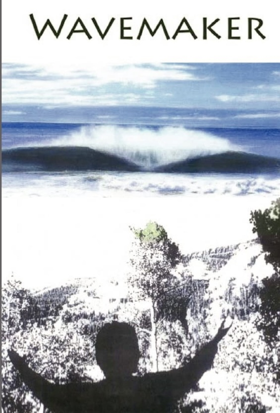

# Wavemaker

Careers are what we all invest our energy and emotions in, either positively or negatively. Positive being the belief that we can make significant progress in this or another organisation and that it will give us the wherewithal to have a happy and productive life. Negative in that we can feel that everyone is out to get us, and the slippery pole has been freshly greased to scupper us. 

That it’s a “not what you know but who you know” world, and, unfortunately, you don’t know anyone. 

**ISBN-10 ‏ : ‎ **1463756682

> Timothy Dyer

Wavemaker The story starts with a young surfer who has a simple dream to get his dad off his back. This simple dream ended up changing the lives of everybody he touched. Being an only child and not having a mother in his life, Glenn Davenport's struggle between his old ways of coping with his overbearing abusive father, Jeff, and a new way he planned to cope with his dad's unpredictable ways. As a teenager who had just started surfing he feels crippled in his mind by a frustrated underachieving drunk of a father who works in a marina on boats. Glenn changes his mode of reactionary defensive lies and deceitful ways, to a truthful loving compassionate one. Fifteen years old he starts this change of belief with the help of a guru, Michael, who miraculously materialized at the moment of a life and death crisis for this young man. This story is based on facts with fiction interwoven throughout it. Experience the surfing gang who he fell in with willingly. They all worked really hard at having as much free fun as they could get their adolescent hands on. Through the use of Glenn's passion for surfing and everything that comes with it, we follow his growth in remembering the divine nature within himself that is spurred on by Michael. Taste the flavor of the beach life that engages all the senses in this story that draws you into Glenn's world. Having faith in getting Jeff involved in Glenn's love of the ocean, Michael planted a seed in Glenn's mind. With the help of his surfing gang they tried their hand at making a wave in the ocean by tricking his dad into captaining this project with his own love of the sea. This incredible journey that this teenager travels on, changes him from a lesser-than spirit into a stand-up self respecting man. As Glenn grew in confidence and self awareness, Michael revealed to him more and more of the mystical powers that are within all of us. Traveling half way around the world to Japan, Europe, and trips from the U.S. to Mexico, Michael's teachings freed Glenn's beliefs from the fears of his past. We read about the struggles he found himself in, on the beaches, the massive waves he rode, and the boats on and in the water. The destitute in Mexico, Mexican officials, Federales, and the mission with Father Juan, as the head of the sanctuary, progressively propel Glenn into a world of selfless service for the local people that have no hope or dreams left in their lives. Going with what he discovered in his heart, his compassion drove him to a life so magical that only a few that have the faith and courage to walk on this path ever achieve. The characters he found himself involved with along the way only heighten his love of humanity which emboldens him to greater and greater accomplishments. This amazing story will challenge you to strive for the same essence that Glenn found after conquering his own fears. Willing himself to walk into the unknown, proving he has what it takes day after day he was included into Michael's world. For his efforts he was allowed to become a part of a selfless order of spirits that relieve the misery in this wonderful world of ours. This order was affectionately nicknamed by some as the Wind Walkers. With this change of mind heaven could not be any sweeter than what he discovered within, then, throughout the world. To find yourself on the doorstep of hell in your own mind one moment, then finding yourself cheering on eternity the next is something to read about. The story starts with Glenn's dream to be free. In the end Glenn finds himself free to be his dream.

> That life’s a bitch and then you die!

